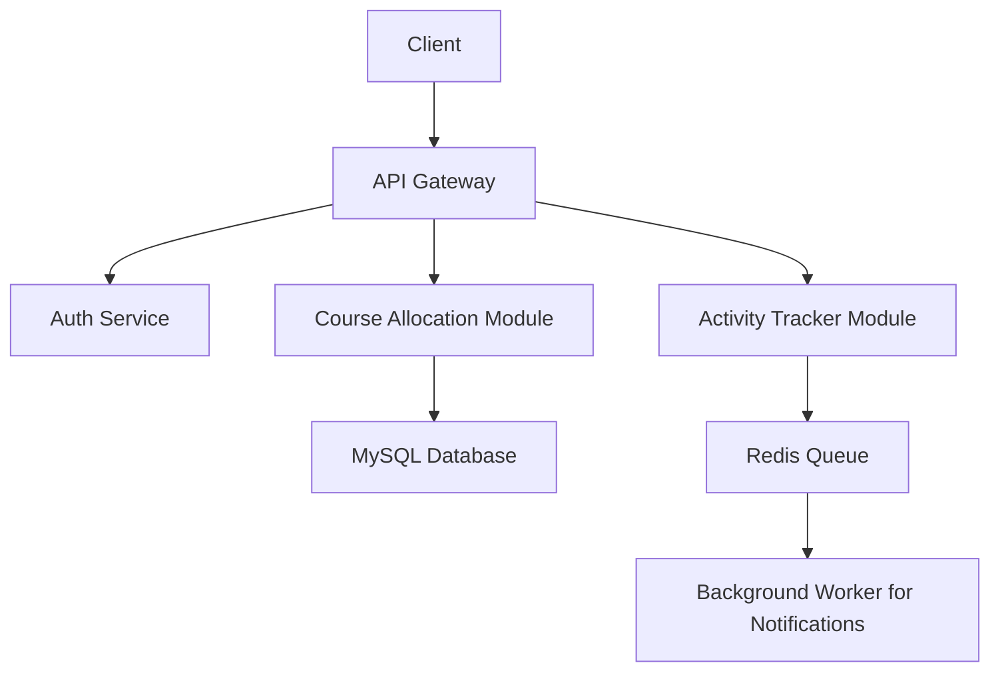

# **Zanda College Course Management Platform**

### **A Comprehensive Academic Backend System for Institutional Efficiency**

**Developer:** Daniel IRYIVUZE
**Institution:** Zanda College, Rwanda
**Repository:** [GitHub Repository](https://github.com/Daniel-IRYIVUZE/Course_Management_Platform)
**Last Updated:** July 2025
**Project Type:** Academic — Summative Backend Development Assessment

---

## **Table of Contents**

1. [Project Overview](#project-overview)
2. [Key Features](#key-features)
3. [Technology Stack](#technology-stack)
4. [System Architecture](#system-architecture)
5. [Installation Guide](#installation-guide)
6. [Configuration](#configuration)
7. [Running the Application](#running-the-application)
8. [API Documentation](#api-documentation)
9. [Testing](#testing)
10. [Deployment Notes](#deployment-notes)
11. [Future Improvements](#future-improvements)
12. [Contributing](#contributing)
13. [License](#license)
14. [Contact](#contact)

---

## **Project Overview**

The **Zanda College Course Management Platform** is a **role-based backend application** designed for managing faculty operations and monitoring student learning activities. Developed as part of an **academic summative project** for a backend development course, it integrates RESTful API principles with real-world academic workflows.

The system aims to simplify course assignments, track teaching activities, and collect student feedback — supporting a more organized, transparent, and data-driven academic administration for Zanda College, Rwanda.

### **Core Modules Include:**

1. **Course Allocation System** – Assigns facilitators to courses per intake/trimester.
2. **Facilitator Activity Tracker (FAT)** – Allows weekly logging of teaching engagement.
3. **Student Reflection Page** – Enables learners to submit multilingual feedback on courses and facilitators.

The system also integrates **JWT-based authentication**, **Redis-powered background job queues**, and **Swagger documentation**, providing a professional-level implementation suitable for production environments.

---

## **Key Features**

### **Module 1: Course Allocation System**

* Role-based access (Manager vs Facilitator)
* CRUD operations for course allocation
* Filter by trimester, cohort, intake, and delivery mode
* Sequelize Models:

  * `User` (with roles)
  * `Module` (Course metadata)
  * `CourseOffering` (Assignment log)

### **Module 2: Facilitator Activity Tracker (FAT)**

* Weekly logging of session attendance, grading status, moderation status
* Submission status indicators: `Done`, `Pending`, `Not Started`
* Redis-powered notifications:

  * Late submission reminders
  * Manager alerting system
* Background job queue (with `Bull`) for async processing

### **Module 3: Student Reflection Page**

* Static front-end (HTML/CSS/JavaScript)
* Multilingual interface: English and French
* Hosted on GitHub Pages with language toggle support

---

## **Technology Stack**

| Category           | Technologies Used               |
| ------------------ | ------------------------------- |
| Backend            | Node.js, Express.js             |
| ORM & DB           | Sequelize ORM, MySQL            |
| Authentication     | JWT, bcrypt                     |
| Caching & Queueing | Redis, Bull                     |
| API Documentation  | Swagger UI                      |
| Testing            | Jest, Supertest                 |
| Frontend (Static)  | HTML5, CSS3, Vanilla JavaScript |

---

## **System Architecture**



---

## **Installation Guide**

### Prerequisites

* Node.js v14+
* MySQL v8+
* Redis

### Setup Instructions

1. **Clone the repository**

```bash
git clone https://github.com/Daniel-IRYIVUZE/Course_Management_Platform.git
cd Course_Management_Platform
```

2. **Install dependencies**

```bash
npm install
```

3. **Set up the database**

```bash
npx sequelize-cli db:create
npx sequelize-cli db:migrate
npx sequelize-cli db:seed:all 
```

4. **Create `.env` configuration file**

```env
PORT=3000
DB_HOST=localhost
DB_USER=your_username
DB_PASSWORD=your_password
DB_NAME=zanda_college_cms
JWT_SECRET=your_jwt_secret
REDIS_HOST=localhost
REDIS_PORT=6379
```

---

## **Running the Application**

1. **Start Redis**

```bash
redis-server
```

2. **Run the development server**

```bash
npm run dev
```

3. **Start background worker**

```bash
npm run worker
```

4. **Access the application**

* Swagger Docs: `http://localhost:3000/api-docs`
* Student Reflection Page: `http://localhost:3000/reflection`

---

## **API Documentation**

### Authentication

| Endpoint              | Description                    |
| --------------------- | ------------------------------ |
| `POST /auth/register` | Register Managers/Facilitators |
| `POST /auth/login`    | User Login with JWT Token      |

### Course Management

| Endpoint                 | Description                      |
| ------------------------ | -------------------------------- |
| `GET /course-offerings`  | List/filter course offerings     |
| `POST /course-offerings` | Assign a facilitator to a course |

### Activity Logs

| Endpoint              | Description                |
| --------------------- | -------------------------- |
| `POST /activity-logs` | Submit weekly teaching log |
| `GET /activity-logs`  | View past log submissions  |

---

## **Testing**

Run tests using:

```bash
npm test
```

Coverage includes:

* User authentication
* Course allocation logic
* Activity log tracking and status

---

## **Deployment Notes**

For production deployment:

* Use **PM2** for process management

```bash
pm2 start server.js --name "zanda-cms-api"
pm2 start workers/notification.worker.js --name "zanda-worker"
```

* Use **NGINX** as a reverse proxy
* Configure **environment variables securely**
* Deploy **Reflection UI** on GitHub Pages or integrate into a React frontend

---

## **Future Improvements**

* Add **Kinyarwanda** language support
* Develop **mobile-responsive frontend**
* Integrate **email/SMS notifications** via Redis queues
* Build **admin analytics dashboard** for course/faculty insights

---

## **Contributing**

All contributions are welcome:

1. Fork the repository
2. Create a feature branch

```bash
git checkout -b feature/your-feature-name
```

3. Push changes and submit a pull request

---

## **License**

MIT License – feel free to use, modify, and distribute for educational or institutional purposes.

---

## **Contact**

- Daniel IRYIVUZE
- Email: [d.iryivuze@alustudent.com](mailto:d.iryivuze@alustudent.com)
- GitHub: [Daniel-IRYIVUZE](https://github.com/Daniel-IRYIVUZE)

---
